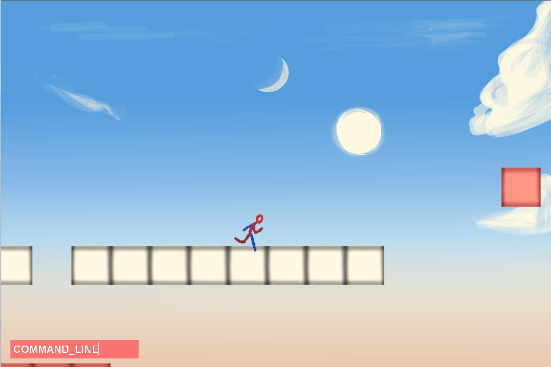

This was a platformer I was making in Ruby for a game jam.  I didn't get very far, but I had an animation system, maps that could be loaded from files, and a simple command line.  It utilizes the Gosu gem for the actual "gamey" parts.  I had never used Ruby for such a large project, but it was an absolute blast.  Ruby is such a powerful language, and while I'm certian my code isn't very good Ruby, it was still fun to write, and fairly readable.

I got about 600 lines in when I realized OCRA (the One Click Ruby Application Builder) had suddenly stopped working with my code, despite the scripts running fine on the interpreter.  I decided I'd rather not risk being unable to distribute my game, so I've begun making the game in C++ with SDL instead.  I figured this code may be of use to someone else, so I've released it under the GPL license.

If you're interested in running this game, you will need the latest version of Ruby and the Gosu Rubygem.  Hope you have fun!
